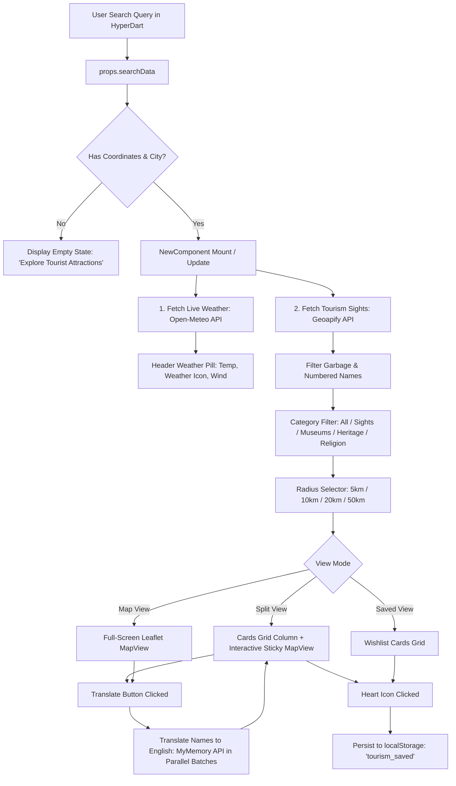

# 🌍 Tourism Explorer — Comprehensive Project Documentation

Welcome to the **Tourism Explorer** project documentation. This document covers the architecture, tech stack, complete file tree, data flow, API integrations, and feature breakdown.

---

## 📑 Table of Contents
1. [Project Overview](#-project-overview)
2. [Tech Stack & Dependencies](#-tech-stack--dependencies)
3. [Complete File & Folder Structure](#-complete-file--folder-structure)
4. [Architecture & Data Flow](#-architecture--data-flow)
5. [Key Features & Capabilities](#-key-features--capabilities)
6. [API Integrations & External Services](#-api-integrations--external-services)
7. [Component & State Breakdown](#-component--state-breakdown)
8. [Setup, Run & Build Commands](#-setup-run--build-commands)

---

## 🔭 Project Overview

**Tourism Explorer** (`@tanishq1741/tourism`) is an interactive travel companion and tourist attractions exploration component built for the **HyperDart Sandbox / Extension** environment.

When a user searches for a city or destination in HyperDart, the component:
1. Resolves city geographic coordinates (`lat`, `lon`) and destination name.
2. Displays real-time **live weather** (temperature, conditions, wind speed) via Open-Meteo.
3. Queries **Geoapify Places API** for authentic tourism sights, heritage landmarks, museums, and places of interest within an adjustable search radius (5km–50km).
4. Provides multi-mode views (**Split View**, **Full Map View**, and **Saved Places / Wishlist**).
5. Supports on-demand **translation to English** (handling Japanese, French, Spanish, German, Italian, etc.) via the MyMemory Translation API.
6. Allows saving favorites to a persistent **localStorage Wishlist** with one-click direct Google Maps navigation.

---

## 🛠️ Tech Stack & Dependencies

### Frontend
- **Framework**: [React 19](https://react.dev/) + [React DOM 19](https://react.dev/)
- **Build Tool**: [Vite 6](https://vitejs.dev/) with `@vitejs/plugin-react`
- **Styling**: [Tailwind CSS v4](https://tailwindcss.com/) with `@tailwindcss/vite`
- **Maps**: [Leaflet 1.9.4](https://leafletjs.com/) + [React-Leaflet 5.0](https://react-leaflet.js.org/) + OpenStreetMap tiles
- **Icons**: [lucide-react](https://lucide.dev/)
- **Platform SDK**: `@hyperdart/frontend` (v2.0.0) with `withHD()` HOC

### Backend / Server
- **Server**: [Express 5.2.1](https://expressjs.com/) (Node.js ES Modules)
- **CORS**: `cors` middleware
- **Platform SDK**: `@hyperdart/backend` (v2.0.2)
- **Deployment Config**: Cloudflare Wrangler config (`wrangler.jsonc`)

---

## 📁 Complete File & Folder Structure

```
tourism9to5/
├── dist/                             # Production build outputs
│   ├── frontend/
│   │   └── index.modern.js          # Modern ES Module bundle
│   └── index.umd.js                 # UMD bundle for HyperDart embedding
├── node_modules/                     # Installed npm packages
├── src/
│   ├── backend/                      # Backend Express service
│   │   ├── index.js                  # Express API server (trips & favorites endpoints)
│   │   ├── package.json              # Backend package manifest
│   │   ├── schema.jsonc              # Backend schema definitions
│   │   └── wrangler.jsonc            # Cloudflare Workers / Wrangler deployment config
│   ├── frontend/                     # Main frontend component
│   │   ├── components/               # Subcomponents & Views
│   │   │   ├── ApiKeyModal.jsx       # Modal for setting/updating Geoapify API key
│   │   │   ├── AttractionCard.jsx    # Card presentation component for places
│   │   │   ├── HyperDartInspector.jsx# Debugging / inspector widget for searchData
│   │   │   ├── MapView.jsx           # Interactive Leaflet map with custom markers
│   │   │   ├── Navbar.jsx            # Top navigation bar
│   │   │   ├── QuerySearchBar.jsx    # Standalone query search input
│   │   │   ├── SavedTripsDrawer.jsx  # Slide-over drawer for saved trips
│   │   │   └── SmartItineraryBuilder.jsx # Automatic daily itinerary generator
│   │   ├── utils/                    # Utility scripts & helpers
│   │   │   ├── geoapifyService.js    # Geoapify API wrapper & request builders
│   │   │   ├── mockData.js           # Fallback sights data (Paris, Tokyo, etc.)
│   │   │   └── nerParser.js          # Named Entity Recognition query parser
│   │   ├── index.css                 # Tailwind CSS root imports & custom scrollbar styles
│   │   ├── index.jsx                 # Main entrypoint wrapped with `withHD(NewComponent)`
│   │   ├── NewComponent.jsx          # Primary feature-rich Tourism UI component
│   │   └── TourismExplorer.jsx       # Alternate / modular explorer layout
│   └── sandbox/                      # Local standalone dev sandbox
│       ├── index.css                 # Sandbox styles
│       └── main.jsx                  # Sandbox React root mount
├── .env.development                  # Local development environment variables
├── DOCUMENTATION.md                  # Detailed project documentation (this file)
├── hyperdart.config.js               # HyperDart component configuration & metadata
├── index.html                        # Vite development index HTML
├── package.json                      # Project dependencies, scripts & metadata
├── package-lock.json                 # Lockfile for reproducible builds
├── README.md                         # Quick-start README
├── RESOURCE.md                       # Resource schema documentation
├── resource.json                     # HyperDart resource schema definition
├── searchData.json                   # Mock search queries for local testing
├── stats.html                        # Rollup bundle visualization report
└── vite.config.js                    # Vite bundler & build pipeline configuration
```

---

## 🔄 Architecture & Data Flow



### Detailed Flow Steps:
1. **Search Extraction (`props.searchData`)**:
   - `searchData` provides `geo_info` (or `ner_analysis`/`query`).
   - The resolved coordinates (`lat`, `lon`) and formatted city name (`cityName`) are parsed.
2. **Weather Retrieval**:
   - `useEffect` queries `api.open-meteo.com` using `lat` and `lon`.
   - The weather code is mapped to human-readable text and weather emojis (☀️, ⛅, 🌧️, ❄️, ⛈️).
3. **Attractions Query (Geoapify)**:
   - Queries `https://api.geoapify.com/v2/places` with categories: `tourism.sights`, `heritage`, `entertainment.museum`, `religion`.
   - Cleaned with an `isGenuineName()` filter to remove unnamed or pure numeric entries.
4. **Interactive Controls**:
   - **Radius Selector**: Dropdown to change distance circle (`5km`, `10km`, `20km`, `50km`).
   - **Category Pills**: Filter by category (`All`, `Sights`, `Museums`, `Heritage`, `Religion`).
   - **View Switcher**: Toggle between `Split`, `Map`, and `Saved` modes.
   - **Translate Toggle**: Calls `MyMemory` translation API in concurrent batches of 5 to translate foreign place names (French, Spanish, Japanese, etc.) into English.
   - **Wishlist Heart**: Saves/removes places from `localStorage` (`tourism_saved`).

---

## ✨ Key Features & Capabilities

| Feature | Description |
|---|---|
| **Empty Search State** | Clean intro screen with sample suggestions (Paris, Tokyo, Agra, London) when no search is active. |
| **Live City Weather** | Real-time temperature (°C), weather status, and wind speed in the header without needing an API key. |
| **Interactive Minimap** | Leaflet map with custom orange markers, automatic fly-to animations on place click, and tile switching. |
| **Radius Selector** | Dynamic search radius (5km, 10km, 20km, 50km) with automatic re-fetching on change. |
| **Category Filter Bar** | Quick tabs (`All`, `Sights`, `Museums`, `Heritage`, `Religion`) that filter cards & map markers instantly. |
| **Multi-Language Translation** | Instant English translation for Japanese, French, Spanish, German, Italian, etc. via MyMemory API. |
| **Saved Places / Wishlist** | Persistent favorites storage in `localStorage`, counter badge in header, and dedicated "Saved" tab. |
| **Direct Google Maps Navigation** | 1-click link on every card opening Google Maps with precise coordinates. |
| **Sidebar & Fullscreen Responsive** | Fixed top header with scrollable body (`h-[100dvh] min-h-[600px]`) that adapts to narrow sidebars. |

---

## 🌐 API Integrations & External Services

### 1. Geoapify Places API
- **Purpose**: Retrieves tourist sights, cultural landmarks, museums, and religious heritage sites.
- **Endpoint**: `https://api.geoapify.com/v2/places`
- **Parameters Used**:
  - `categories`: `tourism.sights,heritage,entertainment.museum,religion`
  - `filter`: `circle:${targetLon},${targetLat},${targetRadius}`
  - `limit`: `50`
  - `lang`: `en`
  - `apiKey`: Stored in `localStorage` or hardcoded fallback.

### 2. Open-Meteo Weather API
- **Purpose**: Provides keyless, real-time live weather conditions for the resolved coordinates.
- **Endpoint**: `https://api.open-meteo.com/v1/forecast`
- **Parameters**: `latitude=${lat}&longitude=${lon}&current_weather=true`

### 3. MyMemory Translated API
- **Purpose**: Translates non-English and European place names (French, Spanish, Japanese, etc.) to English.
- **Endpoint**: `https://api.mymemory.translated.net/get`
- **Parameters**: `q=${encodeURIComponent(name)}&langpair=autodetect|en`

### 4. OpenStreetMap & CARTO Tiles
- **Purpose**: Map tile rendering within Leaflet.
- **URL**: `https://{s}.tile.openstreetmap.org/{z}/{x}/{y}.png`

---

## 🧩 Component & State Breakdown

### `NewComponent.jsx` State Variables:
- `places`: Array of place objects returned from Geoapify.
- `loading`: Boolean state indicating API request in progress.
- `error`: Error message string (if request fails).
- `selectedPlace`: Active place object highlighted on map / list.
- `viewMode`: `'split'` (List + Map), `'map'` (Full Map), or `'saved'` (Wishlist).
- `translations`: Key-value cache `{ [originalName]: translatedName }`.
- `translating`: Boolean state indicating active translation batch.
- `activeCategory`: Selected category filter tab (`'All' | 'Sights' | 'Museums' | 'Heritage' | 'Religion'`).
- `radius`: Current search radius in meters (default `20000`).
- `weather`: Current weather object `{ temperature, weathercode, windspeed }`.
- `savedPlaces`: Array of saved place objects read from / written to `localStorage.getItem('tourism_saved')`.

---

## 🚀 Setup, Run & Build Commands

### 1. Install Dependencies
```bash
npm install
```

### 2. Run Local Development Server
```bash
npm start
# Server starts at http://localhost:5173
```

### 3. Run Backend Server (Optional)
```bash
node src/backend/index.js
# Express server runs on port 3000
```

### 4. Build for Production / HyperDart
```bash
npm run build
# Outputs UMD and Modern ES Module bundles to dist/
```

---

*Authored for the **Tourism Explorer** component on HyperDart.*
